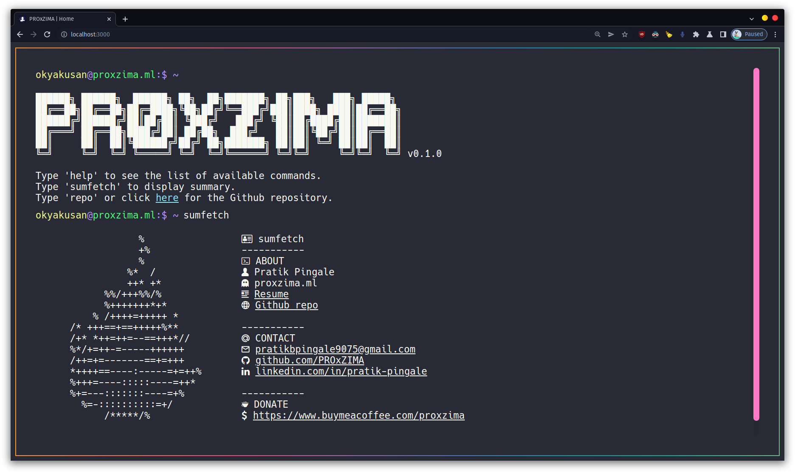
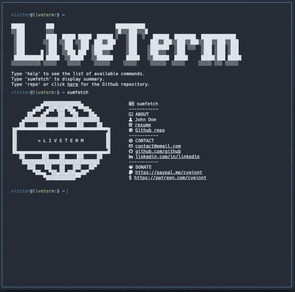
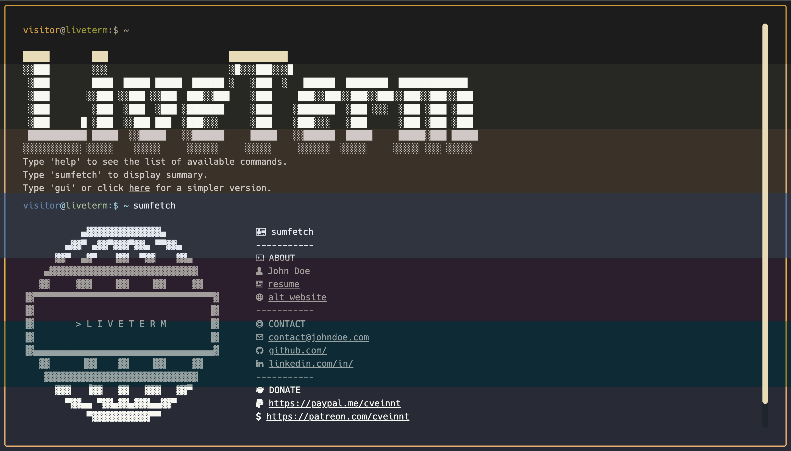

# [💻 LiveTerm - build terminal styled websites in minutes!](https://proxzima.dev)

Highly customizable, easy-to-use, and minimal terminal styled website template, powered by Next.js.

Building a simple website with LiveTerm only takes **minutes**, and you only need to work with **one** file: `config.json`. After you cloned this repository, simply run `yarn install && yarn dev` and start editing `config.json` to build your website!

LiveTerm can be used to build a variety of websites:

- [Personal website](https://proxzima.dev)
- [Project page](https://github.com/PROxZIMA/proxzima.github.io)
- or maybe just a cool browser music player...be creative!

## 📸 Showcase

<p align="center">
<br>
<strong>My Personal Website</strong>
</p>

<p align="center">
<br>
<strong>LiveTerm with different themes</strong>
</p>

## 🚀 Ship your LiveTerm site in less than 5 minutes

LiveTerm requires the `yarn` package manager. You can install `yarn` [here](https://classic.yarnpkg.com/lang/en/docs/install/).

Simply run the following commmand in your terminal:

```bash
$ sh -c "$(curl -fsSL https://raw.github.com/PROxZIMA/proxzima.github.io/main/install/install.sh)"
```

This will install LiveTerm to the current directory. You can start building your website with:

```bash
$ cd LiveTerm && yarn dev
```

Start editing `config.json` and try saving and see the updated changes!

Alternatively, you can clone this repository to a location of your choosing

```bash
$ git clone https://github.com/PROxZIMA/proxzima.github.io.git LiveTerm && cd LiveTerm
```

Then install dependencies and start developing there:

```bash
$ yarn install && yarn dev
```

## 📄 Configuration

### Basic Configuration

90% of LiveTerm's configurations are done through the `config.json` file.

```javascript
{
  "readmeUrl": // create a Github README and link it here!
  "title": // title of the website
  "name": // your name, included in 'about' command
  "ascii": // ascii art to display
  "social": {
    "github": // your handle
    "linkedin": // your handle
  },
  "email": // your email
  "ps1_hostname": "liveterm" // hostname in prompt
  "ps1_username": "visitor", // username in prompt
  "resume_url": "../resume.pdf", // path to your resume
  "colors": {
    "light": {
      ...
    },
    "dark": {
      ... // you can use existing templates in themes.json or use your own!
    }
  }
}
```

Feel free to change it as you see fit!

### Themes

You can find several pre-configured themes in `themes.json`, and you can replace the colors in `config.json` with the theme color you like! The themes are based on the themes on [this website](https://glitchbone.github.io/vscode-base16-term/#/).

For a better preview of the themes, checkout the images in the `demo` folder.

<p align="center">
<br>
<strong>LiveTerm with different themes</strong>
</p>

### Favicons

Favicons are located in `public/`, along with the other files you may want to upload to your website. I used this [website](https://www.favicon-generator.org/) to generate favicons.

### Banner

You may also want to change the output of the `banner` command. To do that, simply paste your generated banner in `src/utils/bin/commands.ts`. I used this [website](https://manytools.org/hacker-tools/ascii-banner/) to generate my banner.

### Advanced Configuration

If you want to further customize your page, feel free to change the source code to your liking!

## 🌐 Deploy on Github Pages

1. Create repository.
2. Link it to your github account.
3. Publish your master branch.

```bash
$ npm run deploy
```

### Custom domain setting

You can add on to the deploy command to create the CNAME file for you. GitHub detects this file and automatically updates the custom domain setting. Edit the package.json deploy script and replace example.com with your custom domain. (Thank you to @jabacchetta)

```bash
rm -rf node_modules/.cache
&& rimraf out
&& next build
&& next export
&& touch out/.nojekyll
&& touch out/CNAME
&& echo \"example.com\" >> out/CNAME
&& git add out/
&& git commit -m "🚀 Deploy Webpage to gh-pages"
&& git subtree push --prefix out origin gh-pages
```

## 🙌 Credit

Based on Cveinnt's awesome [LiveTerm](https://github.com/Cveinnt/LiveTerm).
